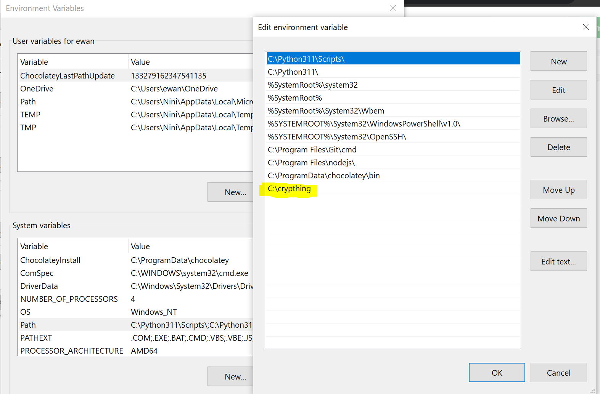

# How to Run 

- Make sure to have Python installed
- Clone the repository by entering command
  ```vscode
      git clone https://github.com/tonsz/crypthing.git
  ```
- Add the directory's absolute path to the Environment Variables, like this

- Run the app by opening the Windows Run Dialog with ` Win + R ` 
- Type `crypthing` and press Enter